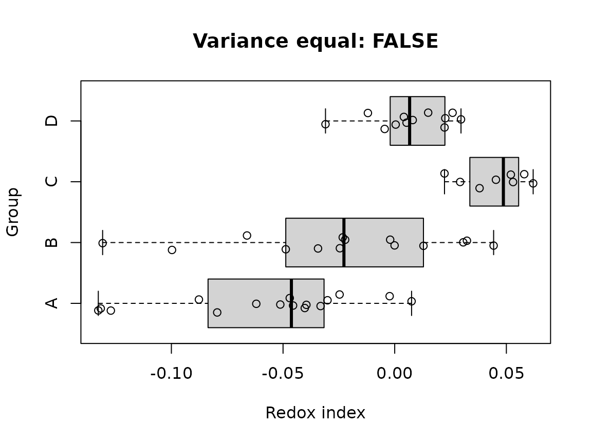
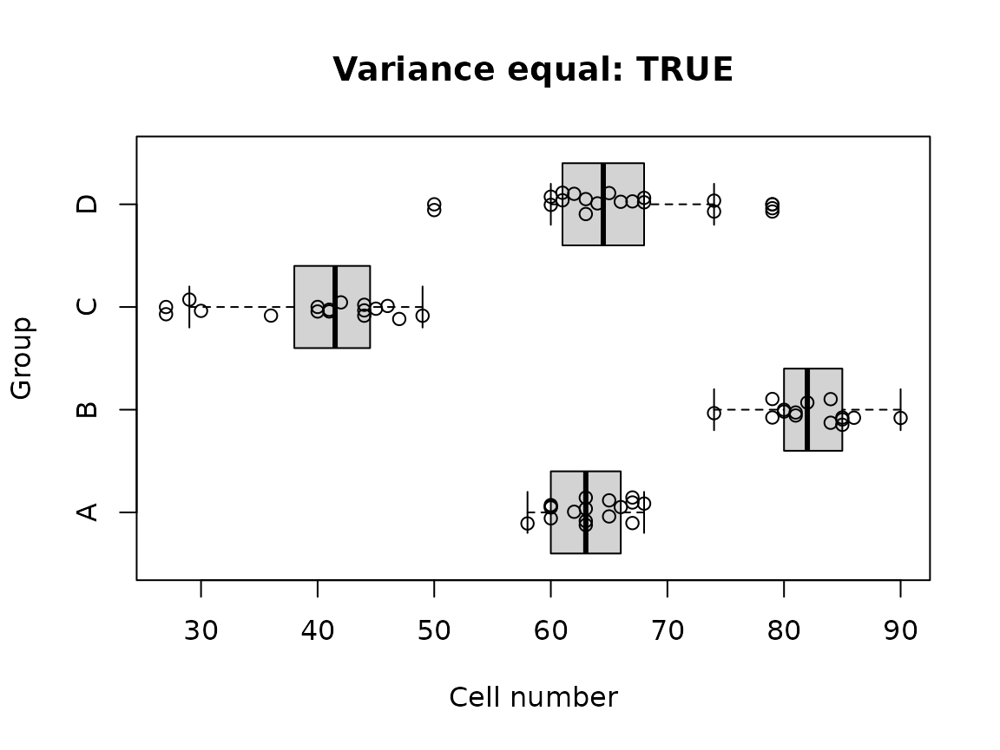

# varequal

## 1. Overview

The **`varequal`** R package provides a unified interface to several
classical, robust, rank-based, and variance-outlier-oriented procedures
for assessing the homogeneity of variances (**homoscedasticity**), that
is, whether the variances of a response variable are equal across
independent groups. The package also provides high-level functions for
automatically combining several tests into a single variance-homogeneity
decision.

The main functionality:

- **`*_test`** Individual tests of a homogeneity-of-variance procedure;
- **[`check_var_equal()`](https://p10911004-npust.github.io/varequal/reference/check_var_equal.md)**
  as a wrapper for selecting an individual test; and
- **[`is_var_equal()`](https://p10911004-npust.github.io/varequal/reference/is_var_equal.md)**
  as a higher-level assessment combining five tests.

  

## 2. Installation

Install the released version from
[CRAN](https://cran.r-project.org/package=varequal):

``` r

install.packages("varequal")
```

Or install the development version from
[GitHub](https://github.com/P10911004-NPUST/varequal):

``` r

if (!require("pak")) install.packages("pak")
pak::pak("P10911004-NPUST/varequal")
```

Then load the package:

``` r

library(varequal)

# For reproducibility
set.seed(123)
```

  

## 3. Quick start

``` r

data("roGFP")

df1 <- roGFP[[1]]

is_var_equal(df1, ro ~ grp)
#> [1] FALSE
```

If you want to inspect the component tests, request a summary:

``` r

is_var_equal(df1, ro ~ grp, summary = TRUE)
#> $is_var_equal
#> [1] FALSE
#> 
#> $summary
#>                                  is_var_equal         pval statistic
#> Modified Brown-Forsythe (Fvalue)        FALSE 2.918003e-02  3.976918
#> Fligner-Killeen (ChiSquare)              TRUE 6.677704e-02  7.166465
#> 't Lam's G (Fvalue)                     FALSE 1.326224e-05  8.351380
#> Levene's (Fvalue)                       FALSE 3.250316e-02  3.183717
#> O'Neill-Mathews (Fvalue)                FALSE 4.693756e-02  2.861920
#>                                  critical_value
#> Modified Brown-Forsythe (Fvalue)       3.310109
#> Fligner-Killeen (ChiSquare)            7.814728
#> 't Lam's G (Fvalue)                    3.400135
#> Levene's (Fvalue)                      2.806845
#> O'Neill-Mathews (Fvalue)               2.806845
```

#### If you only require a high-level decision about variance homogeneity, start with `is_var_equal()` and feel free to skip the rest of this guide.

  

For explicit test selection, use
[`check_var_equal()`](https://p10911004-npust.github.io/varequal/reference/check_var_equal.md):

``` r

check_var_equal(df1, ro ~ grp, method = "LV")
#> 
#> ---------------------------------------
#> Levene's homogeneity of variance test
#> 
#> Response: ro
#> 
#>           DF   SS MS Fvalue pvalue
#> Group      3 0.01  0 3.1837 0.0325
#> Residuals 46 0.03  0              
#> Total     49 0.03                 
#> 
#> #> Group variances are unequal.
#> ---------------------------------------
```

  

## 4. Understanding homogeneity-of-variance testing

Homogeneity of variance is an important assumption for many classical
statistical procedures, including one-way ANOVA and related linear-model
analyses. When the group variances differ substantially, the validity of
procedures that rely on a common variance can be affected.

The currently implemented individual tests are:

| Code | Function | Main characteristic |
|:---|:---|:---|
| `AB` | [`Ansari_Bradley_test()`](https://p10911004-npust.github.io/varequal/reference/Ansari_Bradley_test.md) | Rank-based dispersion test |
| `BF` | `Brown_Forsythe_test(method = "BF")` | Robust Levene-type procedure |
| `BL` | [`Bartlett_test()`](https://p10911004-npust.github.io/varequal/reference/Bartlett_test.md) | Classical parametric test |
| `FK` | [`Fligner_Killeen_test()`](https://p10911004-npust.github.io/varequal/reference/Fligner_Killeen_test.md) | Robust rank-based procedure |
| `LG` | [`Lam_G_test()`](https://p10911004-npust.github.io/varequal/reference/Lam_G_test.md) | Variance-outlier-oriented procedure |
| `LV` | [`Levene_test()`](https://p10911004-npust.github.io/varequal/reference/Levene_test.md) | ANOVA-based robust procedure |
| `MBF` | [`Brown_Forsythe_test()`](https://p10911004-npust.github.io/varequal/reference/Brown_Forsythe_test.md) | Mehrotra-modified Brown–Forsythe |
| `OB` | [`O.Brien_test()`](https://p10911004-npust.github.io/varequal/reference/O.Brien_test.md) | O’Brien variance test |
| `OM` | [`O.Neill_Mathews_test()`](https://p10911004-npust.github.io/varequal/reference/O.Neill_Mathews_test.md) | Weighted least-squares Levene-type test |

Most procedures in this package test the null hypothesis that the
variances across the groups are equal:

\\ H_0:\sigma_1^2 = \sigma_2^2 = \cdots = \sigma_k^2 \\

against an alternative in which at least one group variance differs:

\\ H_1:\text{not all }\sigma_i^2\text{ are equal}. \\

The interpretation follows the usual hypothesis-testing framework.

A small *p*-value provides evidence against homogeneity of variance. A
large *p*-value means that the test did not detect sufficient evidence
of unequal variances.

A large *p*-value does **not** prove that all population variances are
exactly equal.

The result should be interpreted together with:

- the sample size in each group;
- the presence or absence of outliers;
- the distributional shape of the response;
- the balance of the experimental design;
- the scientific magnitude of the variance differences; and
- the assumptions of the downstream analysis.

Different tests have different sensitivities. In particular, Bartlett’s
test can be very sensitive to non-normality, whereas robust and
rank-based procedures are generally less affected by departures from
normality.

  

## 5. Data input

The package accepts either:

1.  a data frame together with a formula; or
2.  a list of numeric vectors representing groups.

### 5.1 Data frame and formula

The standard interface is:

``` text
response ~ group
```

For example:

``` r

Levene_test(df1, ro ~ grp)
#> 
#> ---------------------------------------
#> Levene's homogeneity of variance test
#> 
#> Response: ro
#> 
#>           DF   SS MS Fvalue pvalue
#> Group      3 0.01  0 3.1837 0.0325
#> Residuals 46 0.03  0              
#> Total     49 0.03                 
#> 
#> #> Group variances are unequal.
#> ---------------------------------------
```

The response is the dependent variable and the right-hand side
identifies the independent grouping variable.

A data frame containing several experimental variables can therefore be
used directly:

``` r

check_var_equal(df1, ro ~ grp, method = "BF")
#> 
#> --------------------------------------------
#> Brown-Forsythe homogeneity of variance test
#> 
#> Response: ro
#> 
#>              DF   SS   MS Fvalue  pvalue
#> Group         3 0.02 0.01 3.9769 0.01598
#> Residuals 32.86 0.05    0               
#> Total     35.86 0.07                    
#> 
#> #> Group variances are unequal.
#> --------------------------------------------
#> 
#> --------------------------------------------
#> Brown-Forsythe homogeneity of variance test
#> 
#> Response: ro
#> 
#>              DF   SS   MS Fvalue  pvalue
#> Group         3 0.02 0.01 3.9769 0.01598
#> Residuals 32.86 0.05    0               
#> Total     35.86 0.07                    
#> 
#> #> Group variances are unequal.
#> --------------------------------------------
```

### 5.2 A list of numeric vectors

A list can be used when the observations are already separated into
groups.

``` r

x <- list(A = rnorm(12), B = rnorm(12), C = rnorm(12))
is_var_equal(x)
#> [1] TRUE
```

  

## 6. The individual tests

### 6.1 Ansari–Bradley test

[`Ansari_Bradley_test()`](https://p10911004-npust.github.io/varequal/reference/Ansari_Bradley_test.md)
is a rank-based procedure for assessing equality of dispersion.

``` r

ab <- Ansari_Bradley_test(df1, ro ~ grp)
#> 
#> ---------------------------------------------
#>  Ansari-Bradley homogeneity of variance test
#> 
#>  Response: ro
#> 
#>  Chi-Square: 6.0855
#>  Chi-Square critical: 7.8147
#>  p-value: 0.10752
#> 
#>  #> Group variances are equal. 
#> ---------------------------------------------
```

The implementation uses an approximate chi-square statistic. The package
documentation notes that results may be inaccurate for very small total
sample sizes or when there are many tied values. The test is useful as a
nonparametric comparison of dispersion, but it should not automatically
be treated as interchangeable with a robust ANOVA-based homogeneity
test.

### 6.2 Bartlett’s test

[`Bartlett_test()`](https://p10911004-npust.github.io/varequal/reference/Bartlett_test.md)
implements the classical Bartlett test.

Bartlett’s test is the most powerful test when no outliers exist and the
observations follow normal distribution, but it is sensitive to
departures from normality and to outliers.

For data that satisfy the normality assumption reasonably well and are
free of important outliers, Bartlett’s test is an appropriate classical
procedure.

``` r

bl <- Bartlett_test(df1, ro ~ grp, summary = TRUE)
#> 
#> ----------------------------------------
#>  Bartlett's homogeneity of variance test
#> 
#>  Response: y
#> 
#>  Chi-Square: 18.4724
#>  p-value: 0.00035
#> 
#>  #> Group variances are unequal. 
#> ----------------------------------------
```

### 6.3 Brown–Forsythe test

[`Brown_Forsythe_test()`](https://p10911004-npust.github.io/varequal/reference/Brown_Forsythe_test.md)
provides both the original Brown–Forsythe procedure and the
Mehrotra-modified version.

The default method is `"MBF"`:

``` r

mbf <- Brown_Forsythe_test(df1, ro ~ grp)
#> 
#> --------------------------------------------
#> Brown-Forsythe homogeneity of variance test
#> 
#> Response: ro
#> 
#>              DF   SS   MS Fvalue  pvalue
#> Group      1.96 0.01 0.01 3.9769 0.02918
#> Residuals 32.86 0.05    0               
#> Total     34.81 0.06                    
#> 
#> #> Group variances are unequal.
#> --------------------------------------------
```

The original Brown–Forsythe procedure can be selected with
`method = "BF"`:

``` r

bf <- Brown_Forsythe_test(df1, ro ~ grp, method = "BF")
#> 
#> --------------------------------------------
#> Brown-Forsythe homogeneity of variance test
#> 
#> Response: ro
#> 
#>              DF   SS   MS Fvalue  pvalue
#> Group         3 0.02 0.01 3.9769 0.01598
#> Residuals 32.86 0.05    0               
#> Total     35.86 0.07                    
#> 
#> #> Group variances are unequal.
#> --------------------------------------------
```

The Brown–Forsythe approach is a robust modification of Levene’s
procedure that uses a robust location measure, conventionally the group
median.

The package also permits a custom transformation of the response. The
default is based on absolute deviations from the group median:

\\ y'\_{ij} = \|y\_{ij} - \tilde y_i\|. \\

For example:

``` r

Brown_Forsythe_test(df1, ro ~ grp, transform = function(x) abs(x - mean(x)))
#> 
#> --------------------------------------------
#> Brown-Forsythe homogeneity of variance test
#> 
#> Response: ro
#> 
#>              DF   SS   MS Fvalue  pvalue
#> Group      1.89 0.01 0.01 5.0469 0.01406
#> Residuals 30.46 0.04    0               
#> Total     32.35 0.05                    
#> 
#> #> Group variances are unequal.
#> --------------------------------------------
```

The `method` argument distinguishes the two implementations:

- `"BF"`: original Brown–Forsythe procedure;
- `"MBF"`: Mehrotra modification, which adjusts the degrees of freedom.

The modified procedure is designed to reduce Type I error inflation,
with a potential trade-off in power.

### 6.4 Fligner–Killeen test

[`Fligner_Killeen_test()`](https://p10911004-npust.github.io/varequal/reference/Fligner_Killeen_test.md)
is a rank-based procedure that is particularly useful when robustness to
non-normality and outliers is important.

``` r

fk <- Fligner_Killeen_test(df1, ro ~ grp)
#> 
#> ---------------------------------------------
#>  Fligner-Killeen homogeneity of variance test
#> 
#>  Response: ro
#> 
#>  Chi-Square: 7.1665
#>  Chi-Square critical: 7.8147
#>  p-value: 0.06678
#> 
#>  #> Group variances are equal. 
#> ---------------------------------------------
```

The procedure works with ranks of absolute deviations from the group
median and uses a normal-score transformation. `Fligner--Killeen` is an
important general-purpose choice when the normality assumption is
questionable.

### 6.5 ’t Lam’s G test

[`Lam_G_test()`](https://p10911004-npust.github.io/varequal/reference/Lam_G_test.md)
implements ’t Lam’s G procedure. The procedure is related to
Cochran-type variance-outlier assessment rather than being a
conventional homogeneity test in the same sense as Levene’s or
Bartlett’s test.

``` r

lg <- Lam_G_test(df1, ro ~ grp)
#> 
#> ---------------------------------------------
#> 't Lam's G homogeneity of variance test
#> 
#> Response: ro
#> 
#> Outlying group: C
#> 
#> F-value: 8.3514
#> F-critical: 3.4001
#> p-value: 1e-05
#> 
#> #> Group variances are unequal.
#> ---------------------------------------------
```

It supports three alternatives:

``` r

Lam_G_test(df1, ro ~ grp, alternative = "two.sided")
#> 
#> ---------------------------------------------
#> 't Lam's G homogeneity of variance test
#> 
#> Response: ro
#> 
#> Outlying group: C
#> 
#> F-value: 8.3514
#> F-critical: 3.4001
#> p-value: 1e-05
#> 
#> #> Group variances are unequal.
#> ---------------------------------------------
Lam_G_test(df1, ro ~ grp, alternative = "greater")
#> 
#> ---------------------------------------------
#> 't Lam's G homogeneity of variance test
#> 
#> Response: ro
#> 
#> Outlying group: 
#> 
#> F-value: 2.5435
#> F-critical: 2.6257
#> p-value: 0.06043
#> 
#> #> Group variances are equal.
#> ---------------------------------------------
Lam_G_test(df1, ro ~ grp, alternative = "less")
#> 
#> ---------------------------------------------
#> 't Lam's G homogeneity of variance test
#> 
#> Response: ro
#> 
#> Outlying group: C
#> 
#> F-value: 8.3514
#> F-critical: 3.0136
#> p-value: 1e-05
#> 
#> #> Group variances are unequal.
#> ---------------------------------------------
```

The interpretation is directional:

- `"greater"` focuses on unusually large variances;
- `"less"` focuses on unusually small variances;
- `"two.sided"` considers both directions.

The method is highly sensitive to outliers, so it should be used with an
explicit understanding of that property.

### 6.6 Levene’s test

[`Levene_test()`](https://p10911004-npust.github.io/varequal/reference/Levene_test.md)
provides an ANOVA-based test of homogeneity.

``` r

lv <- Levene_test(df1, ro ~ grp)
#> 
#> ---------------------------------------
#> Levene's homogeneity of variance test
#> 
#> Response: ro
#> 
#>           DF   SS MS Fvalue pvalue
#> Group      3 0.01  0 3.1837 0.0325
#> Residuals 46 0.03  0              
#> Total     49 0.03                 
#> 
#> #> Group variances are unequal.
#> ---------------------------------------
```

The implementation uses a transformation of each observation into a
measure of within-group deviation. Its default transformation is the
absolute deviation from the group median:

\\ y'\_{ij} = \|y\_{ij} - \tilde y_i\|. \\

A custom transformation can be supplied:

``` r

Levene_test(df1, ro ~ grp, transform = function(x) (x - median(x)) ^ 2)
#> 
#> ---------------------------------------
#> Levene's homogeneity of variance test
#> 
#> Response: ro
#> 
#>           DF SS MS Fvalue  pvalue
#> Group      3  0  0 2.6281 0.06142
#> Residuals 46  0  0               
#> Total     49  0                  
#> 
#> #> Group variances are equal.
#> ---------------------------------------
```

Other useful transformations include:

``` r

# Absolute deviations from the mean
Levene_test(df1, ro ~ grp, transform = function(x) abs(x - mean(x)))
#> 
#> ---------------------------------------
#> Levene's homogeneity of variance test
#> 
#> Response: ro
#> 
#>           DF   SS MS Fvalue pvalue
#> Group      3 0.01  0 4.1116 0.0115
#> Residuals 46 0.02  0              
#> Total     49 0.03                 
#> 
#> #> Group variances are unequal.
#> ---------------------------------------

# Square-root absolute deviations
Levene_test(df1, ro ~ grp, transform = function(x) sqrt(abs(x - median(x))))
#> 
#> ---------------------------------------
#> Levene's homogeneity of variance test
#> 
#> Response: ro
#> 
#>           DF   SS   MS Fvalue  pvalue
#> Group      3 0.04 0.01 2.4066 0.07934
#> Residuals 46 0.28 0.01               
#> Total     49 0.32                    
#> 
#> #> Group variances are equal.
#> ---------------------------------------
```

The transformation is subsequently analyzed using an ANOVA-style
decomposition.

### 6.7 O’Brien’s test

[`O.Brien_test()`](https://p10911004-npust.github.io/varequal/reference/O.Brien_test.md)
implements O’Brien’s variance-homogeneity procedure.

``` r

ob <- O.Brien_test(df1, ro ~ grp)
#> 
#> ---------------------------------------
#> O'Brien's homogeneity of variance test
#> 
#> Response: ro
#> 
#>           DF SS MS Fvalue  pvalue
#> Group      3  0  0  2.422 0.07793
#> Residuals 46  0  0               
#> Total     49  0                  
#> 
#> #> Group variances are equal.
#> ---------------------------------------
```

The default transformation is based on squared deviations from the group
median:

\\ y'\_{ij} = (y\_{ij} - \tilde y_i)^2. \\

O’Brien’s test can be conservative and may have relatively low power for
some forms of heteroscedasticity. The package documentation therefore
places Levene-type and Brown–Forsythe procedures ahead of O’Brien’s test
for general homogeneity assessment.

### 6.8 O’Neill–Mathews test

[`O.Neill_Mathews_test()`](https://p10911004-npust.github.io/varequal/reference/O.Neill_Mathews_test.md)
implements the weighted least-squares approach to Levene’s test.

``` r

om <- O.Neill_Mathews_test(df1, ro ~ grp)
#> 
#> ---------------------------------------------
#> O'Neill-Mathews homogeneity of variance test
#> 
#> Response: ro
#> 
#>           DF   SS   MS Fvalue  pvalue
#> Group      3 0.02 0.01 2.8619 0.04694
#> Residuals 46 0.09    0               
#> Total     49  0.1                    
#> 
#> #> Group variances are unequal.
#> ---------------------------------------------
```

Its default transformation is again based on absolute deviations from
the group median:

\\ y'\_{ij} = \|y\_{ij} - \tilde y_i\|. \\

This procedure is useful when a weighted least-squares formulation is
desired, particularly when group sizes are unequal.

  

## 7. Selecting a test with `check_var_equal()`

[`check_var_equal()`](https://p10911004-npust.github.io/varequal/reference/check_var_equal.md)
provides a common wrapper around the individual tests. The available
method codes are:

`AB`: Ansari–Bradley test `BL`: Bartlett’s test `FK`: Fligner–Killeen
test `LG`: Lam’s G procedure `LV`: Levene’s test `MBF`:
Mehrotra–modified Brown–Forsythe test `BF`: Brown–Forsythe test `OB`:
O’Brien’s test `OM`: O’Neill–Mathews test

This is particularly useful when the method is selected
programmatically. For example:

``` r

method <- "FK"
result <- check_var_equal(df1, ro ~ grp, method = method, silent = TRUE)
result
#> $method
#> [1] "Fligner-Killeen homogeneity of variance test"
#> 
#> $is_var_equal
#> [1] TRUE
#> 
#> $alpha
#> [1] 0.05
#> 
#> $summary
#> [1] NA
#> 
#> $statistic
#> ChiSquare 
#>  7.166465 
#> 
#> $pvalue
#> [1] 0.06677704
```

  

## 8. Automatic assessment with `is_var_equal()`

[`is_var_equal()`](https://p10911004-npust.github.io/varequal/reference/is_var_equal.md)
combines five procedures:

- Brown–Forsythe;
- Fligner–Killeen;
- ’t Lam’s G;
- Levene;
- O’Neill–Mathews.

The `sensitivity` argument ranges from 1 to 5. A larger value requires
more component tests to agree that the variances are equal:

``` r

for (s in 1:5) 
{
  cat("sensitivity =", s, "\n")
  print(is_var_equal(df1, ro ~ grp, sensitivity = s))
}
#> sensitivity = 1 
#> [1] TRUE
#> sensitivity = 2 
#> [1] FALSE
#> sensitivity = 3 
#> [1] FALSE
#> sensitivity = 4 
#> [1] FALSE
#> sensitivity = 5 
#> [1] FALSE
```

Conceptually:

- `sensitivity = 1` is permissive;
- `sensitivity = 3` is the default;
- `sensitivity = 5` is conservative.

Set `summary = TRUE` to obtain the component-test results:

``` r

result <- is_var_equal(df1, ro ~ grp, summary = TRUE)
result$is_var_equal
#> [1] FALSE
result$summary
#>                                  is_var_equal         pval statistic
#> Modified Brown-Forsythe (Fvalue)        FALSE 2.918003e-02  3.976918
#> Fligner-Killeen (ChiSquare)              TRUE 6.677704e-02  7.166465
#> 't Lam's G (Fvalue)                     FALSE 1.326224e-05  8.351380
#> Levene's (Fvalue)                       FALSE 3.250316e-02  3.183717
#> O'Neill-Mathews (Fvalue)                FALSE 4.693756e-02  2.861920
#>                                  critical_value
#> Modified Brown-Forsythe (Fvalue)       3.310109
#> Fligner-Killeen (ChiSquare)            7.814728
#> 't Lam's G (Fvalue)                    3.400135
#> Levene's (Fvalue)                      2.806845
#> O'Neill-Mathews (Fvalue)               2.806845
```

  

## 9. Why multiple tests can disagree

Different procedures weight distributional features differently.

For example, a dataset can contain:

- approximately equal variances but strong skewness;
- a single extreme observation in one group;
- unequal variances that differ primarily in one group;
- several small groups with low statistical power; or
- unequal sample sizes.

Under such conditions, two valid tests can produce different decisions.

Therefore, the question should not simply be:

> Which test gives a significant *p*-value?

A better question is:

> Which variance-homogeneity procedure is appropriate for the
> distribution, sample size, outlier structure, and experimental design?

[`is_var_equal()`](https://p10911004-npust.github.io/varequal/reference/is_var_equal.md)
is intended to provide a practical aggregate assessment, while the
individual functions allow the analyst to inspect the behavior of
specific procedures.

  

## 10. Inspecting the data before testing

Formal tests should not replace graphical inspection.

For example, boxplots can reveal differences in spread and possible
outliers:

``` r

text = sprintf("Variance equal: %s", is_var_equal(df1, ro ~ grp))
boxplot(ro ~ grp, 
        data = df1, 
        main = text, 
        horizontal = TRUE, 
        xlab = "Redox index", 
        ylab = "Group")
points(x = df1$ro, 
       y = jitter(as.numeric(df1$grp), amount = 0.15))
```



The same graphical strategy can be used with the `CYCB1` dataset.

``` r

data("CYCB1")
df2 <- CYCB1[[2]]
text = sprintf("Variance equal: %s", is_var_equal(df2, cells ~ grp))
boxplot(cells ~ grp,
        data = df2,
        main = text,
        horizontal = TRUE,
        xlab = "Cell number",
        ylab = "Group")
points(x = df2$cells, 
       y = jitter(as.numeric(df2$grp), amount = 0.15))
```



  

## 11. Built-in datasets

### 11.1 `roGFP`

`roGFP` is a list containing three experimental batches. Each data frame
contains:

- `TEMP`: air temperature;
- `RGF1`: RGF1 peptide concentration;
- `treatment`: combined treatment;
- `grp`: group label;
- `ro`: reduced–oxidized redox index.

The redox index ranges from -1 (reduced) to 1 (oxidized).

``` r

data("roGFP")
str(roGFP[[1]])
#> 'data.frame':    50 obs. of  5 variables:
#>  $ TEMP     : Factor w/ 2 levels "22C","31C": 1 1 1 1 1 1 1 1 1 1 ...
#>  $ RGF1     : Factor w/ 2 levels "0nM","5nM": 1 1 1 1 1 1 1 1 1 1 ...
#>  $ treatment: Factor w/ 4 levels "22C_0nM","22C_5nM",..: 1 1 1 1 1 1 1 1 1 1 ...
#>  $ grp      : Factor w/ 4 levels "A","B","C","D": 1 1 1 1 1 1 1 1 1 1 ...
#>  $ ro       : num  -0.0877 -0.0795 -0.062 -0.1316 -0.0455 ...
```

The dataset is based on measurements from *Arabidopsis thaliana* roots.

### 11.2 `CYCB1`

`CYCB1` is a list containing three experimental batches of meristematic
root cell counts. Each data frame contains:

- `TEMP`: air temperature;
- `RGF1`: RGF1 peptide concentration;
- `treatment`: combined treatment;
- `grp`: group label;
- `cells`: number of meristematic root cells.

``` r

data("CYCB1")
str(CYCB1[[1]])
#> 'data.frame':    61 obs. of  5 variables:
#>  $ TEMP     : Factor w/ 2 levels "22C","31C": 1 1 1 1 1 1 1 1 1 1 ...
#>  $ RGF1     : Factor w/ 2 levels "0","5": 1 1 1 1 1 1 1 1 1 1 ...
#>  $ treatment: Factor w/ 4 levels "22C_0","22C_5",..: 1 1 1 1 1 1 1 1 1 1 ...
#>  $ grp      : Factor w/ 4 levels "A","B","C","D": 1 1 1 1 1 1 1 1 1 1 ...
#>  $ cells    : int  57 61 63 64 60 67 65 60 60 58 ...
```

These datasets are included as practical examples for applying variance
homogeneity tests to experimental biological data.

  

## 12. Benchmarking and method performance

For comparing variance-homogeneity procedures, the benchmark uses four
possible outcomes:

- **O_O**: variances are **equal** and the method predicts **equal**;
- **O_X**: variances are **equal** but the method predicts **unequal**;
- **X_X**: variances are **unequal** and the method predicts
  **unequal**;
- **X_O**: variances are **unequal** but the method predicts **equal**.

From these quantities:

\\ \text{Type I error} = \frac{O\\X}{O\\O + O\\X}\times100\\, \\

Higher value of `Type I error` means that when the samples are
homoscedastic, the procedure has greater chance to mis-classify the
variances as heteroscedastic.

\\ \text{Type II error} = \frac{X\\O}{X\\X + X\\O}\times100\\, \\

Higher value of `Type II error` means that when the samples are
heteroscedastic, the procedure has greater chance to mis-classify the
variances as homoscedastic.

\\ \text{Accuracy} = \frac{O\\O + X\\X} {O\\O + O\\X + X\\X +
X\\O}\times100\\. \\

`Accuracy` represent the overall sensitivity and specificity to the
samples homoscedasticity.

### Scenario 1: normally-distributed data, moderate sample size, no outlier

For normally distributed, outlier-free data with group sizes range from
8 to 20:

|     | O_O | O_X | X_X | X_O | Type 1 error (%) | Type 2 error (%) | Accuracy (%) |
|:----|:---:|:---:|:---:|:---:|:----------------:|:----------------:|:------------:|
| BL  | 939 | 61  | 985 | 15  |       6.1        |       1.5        |    96.20     |
| AB  | 974 | 26  | 749 | 251 |       2.6        |       25.1       |    86.15     |
| FK  | 976 | 24  | 824 | 176 |       2.4        |       17.6       |    90.00     |
| MBF | 977 | 23  | 767 | 233 |       2.3        |       23.3       |    87.20     |
| BF  | 973 | 27  | 823 | 177 |       2.7        |       17.7       |    89.80     |
| LV  | 973 | 27  | 864 | 136 |       2.7        |       13.6       |    91.85     |
| OB  | 983 | 17  | 625 | 375 |       1.7        |       37.5       |    80.40     |
| OM  | 983 | 17  | 820 | 180 |       1.7        |       18.0       |    90.15     |
| LG  | 919 | 81  | 982 | 18  |       8.1        |       1.8        |    95.05     |
|     |     |     |     |     |                  |                  |              |

This scenario illustrates the advantage of Bartlett’s test (BL) when its
normality assumptions are satisfied. Its low Type II error produces high
accuracy in this benchmark.

### Scenario 2: normally-distributed data, small sample size, no outlier

For group sizes from 3 to 7, the reported Type II errors become much
larger for many procedures.

|     | O_O | O_X | X_X | X_O | Type 1 error (%) | Type 2 error (%) | Accuracy (%) |
|:----|:---:|:---:|:---:|:---:|:----------------:|:----------------:|:------------:|
| BL  | 957 | 43  | 440 | 560 |       4.3        |       56.0       |    69.85     |
| AB  | 967 | 33  | 104 | 896 |       3.3        |       89.6       |    53.55     |
| FK  | 978 | 22  | 97  | 903 |       2.2        |       90.3       |    53.75     |
| MBF | 991 |  9  | 61  | 939 |       0.9        |       93.9       |    52.60     |
| BF  | 986 | 14  | 75  | 925 |       1.4        |       92.5       |    53.05     |
| LV  | 973 | 27  | 121 | 879 |       2.7        |       87.9       |    54.70     |
| OB  | 996 |  4  | 30  | 970 |       0.4        |       97.0       |    51.30     |
| OM  | 994 |  6  | 58  | 942 |       0.6        |       94.2       |    52.60     |
| LG  | 840 | 160 | 607 | 393 |       16.0       |       39.3       |    72.35     |
|     |     |     |     |     |                  |                  |              |

Small samples can make variance testing intrinsically difficult. A
non-significant result should therefore be interpreted cautiously when
group sizes are very small.

### Scenario 3: normally-distributed data, moderate sample size, with outliers

The benchmark also considers moderate sample sizes (8 ≤ n ≤ 20) with one
or two outliers. The Bartlett and ’t Lam’s G can become extremely
sensitive to the introduced outliers, while rank-based procedures can
maintain substantially better Type II error control.

For example, the reported results include:

|     | O_O  | O_X  | X_X  | X_O | Type 1 error (%) | Type 2 error (%) | Accuracy (%) |
|:----|:----:|:----:|:----:|:---:|:----------------:|:----------------:|:------------:|
| BL  |  0   | 1000 | 1000 |  0  |      100.0       |       0.0        |    50.00     |
| AB  | 972  |  28  | 843  | 157 |       2.8        |       15.7       |    90.75     |
| FK  | 974  |  26  | 910  | 90  |       2.6        |       9.0        |    94.20     |
| MBF | 1000 |  0   | 590  | 410 |       0.0        |       41.0       |    79.50     |
| BF  | 1000 |  0   | 745  | 255 |       0.0        |       25.5       |    87.25     |
| LV  | 1000 |  0   | 790  | 210 |       0.0        |       21.0       |    89.50     |
| OB  | 1000 |  0   | 101  | 899 |       0.0        |       89.9       |    55.05     |
| OM  | 1000 |  0   | 713  | 287 |       0.0        |       28.7       |    85.65     |
| LG  |  0   | 1000 | 1000 |  0  |      100.0       |       0.0        |    50.00     |
|     |      |      |      |     |                  |                  |              |

### Practical interpretation

The benchmark supports three general principles:

1.  **Normal, clean data:** Bartlett’s test can be highly effective.
2.  **Non-normal or contaminated data:** robust procedures such as
    Brown–Forsythe and Fligner–Killeen are preferable.
3.  **Very small samples:** All methods show poor power to detect
    heteroscedasticity (perhaps Lam’s G procedure is a better choice).

The benchmark is a simulation study rather than a universal ranking of
methods. Results depend on the exact simulation design, and performance
under a user’s data-generating process can differ.

  

## Summary

The principal functions are:

- [`is_var_equal()`](https://p10911004-npust.github.io/varequal/reference/is_var_equal.md)
  for an aggregate assessment based on multiple tests;
- [`check_var_equal()`](https://p10911004-npust.github.io/varequal/reference/check_var_equal.md)
  for selecting a specific procedure by method code;
- [`Brown_Forsythe_test()`](https://p10911004-npust.github.io/varequal/reference/Brown_Forsythe_test.md)
  for a robust Levene-type approach;
- [`Fligner_Killeen_test()`](https://p10911004-npust.github.io/varequal/reference/Fligner_Killeen_test.md)
  for a robust rank-based procedure;
- [`Levene_test()`](https://p10911004-npust.github.io/varequal/reference/Levene_test.md)
  for an ANOVA-based approach;
- [`Bartlett_test()`](https://p10911004-npust.github.io/varequal/reference/Bartlett_test.md)
  for classical normal-theory testing;
- [`Ansari_Bradley_test()`](https://p10911004-npust.github.io/varequal/reference/Ansari_Bradley_test.md)
  for rank-based dispersion assessment;
- [`Lam_G_test()`](https://p10911004-npust.github.io/varequal/reference/Lam_G_test.md)
  for variance-outlier-oriented assessment;
- [`O.Brien_test()`](https://p10911004-npust.github.io/varequal/reference/O.Brien_test.md)
  for O’Brien’s variance test; and
- [`O.Neill_Mathews_test()`](https://p10911004-npust.github.io/varequal/reference/O.Neill_Mathews_test.md)
  for a weighted least-squares Levene-type approach.

  

## References

Ansari, A. R., & Bradley, R. A. (1960). Rank-sum tests for dispersions.
*The Annals of Mathematical Statistics*, 31, 1174–1189.

Bartlett, M. S. (1937). Properties of sufficiency and statistical tests.
*Proceedings of the Royal Society of London. Series A*, 160(901),
268–282. <https://doi.org/10.1098/rspa.1937.0109>

Brown, M. B., & Forsythe, A. B. (1974). Robust tests for the equality of
variances. *Journal of the American Statistical Association*, 69(346),
364–367. <https://doi.org/10.1080/01621459.1974.10482955>

Conover, W. J., Johnson, M. E., & Johnson, M. M. (1981). A comparative
study of tests for homogeneity of variances, with applications to the
outer continental shelf bidding data. *Technometrics*, 23, 351–361.
<https://doi.org/10.1080/00401706.1981.10487680>

Fligner, M. A., & Killeen, T. J. (1976). Distribution-free two-sample
tests for scale. *Journal of the American Statistical Association*,
71(353), 210–213. <https://doi.org/10.1080/01621459.1976.10481517>

Mehrotra, D. V. (1997). Improving the Brown–Forsythe solution to the
generalized Behrens–Fisher problem. *Communications in
Statistics–Simulation and Computation*, 26, 1139–1145.
<https://doi.org/10.1080/03610919708813431>

O’Brien, R. G. (1981). A simple test for variance effects in
experimental designs. *Psychological Bulletin*, 89(3), 570–574.
<https://doi.org/10.1037/0033-2909.89.3.570>

O’Neill, M. E., & Mathews, K. (2000). Theory & Methods: A Weighted Least
Squares Approach to Levene’s Test of Homogeneity of Variance.
*Australian & New Zealand Journal of Statistics*, 42(1), 81–100.
<https://doi.org/10.1111/1467-842X.00109>

Sharma, D., & Kibria, B. M. G. (2013). On some test statistics for
testing homogeneity of variances: A comparative study. *Journal of
Statistical Computation and Simulation*, 83, 1944–1963.
<https://doi.org/10.1080/00949655.2012.675336>

’t Lam, R. U. E. (2010). Scrutiny of variance results for outliers:
Cochran’s test optimized. *Analytica Chimica Acta*, 659(1–2), 68–84.
<https://doi.org/10.1016/j.aca.2009.11.032>

Zhou, Y., Zhu, Y., & Wong, W. K. (2023). Statistical tests for
homogeneity of variance for clinical trials and recommendations.
*Contemporary Clinical Trials Communications*, 33, 101119.
<https://doi.org/10.1016/j.conctc.2023.101119>
